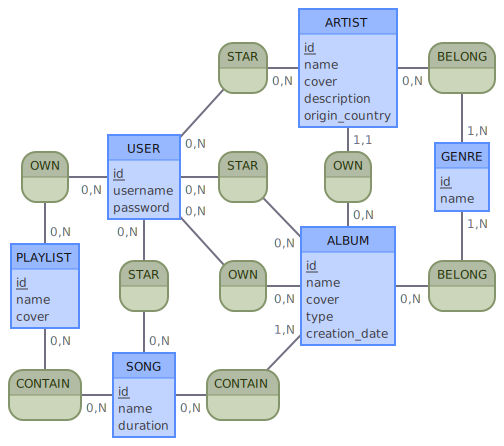
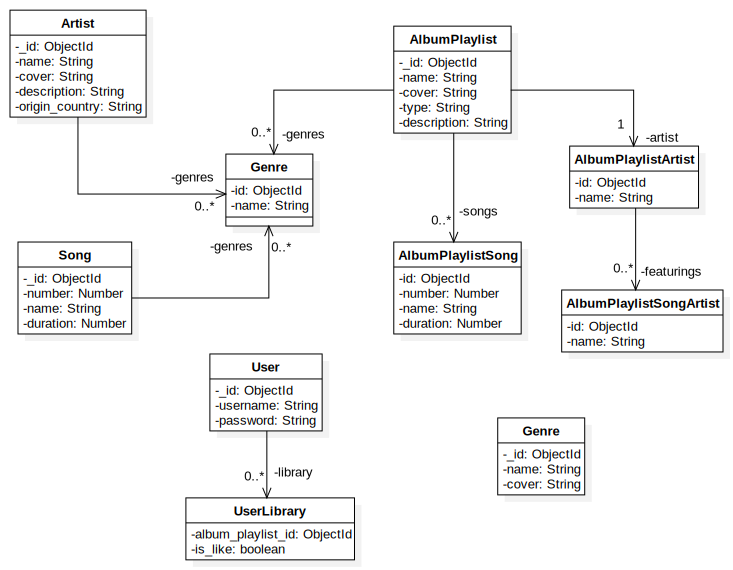

# Documentation

## MCD



### Comments

**User**

He represents the application user.

He have a library of albums and playlists.

He can like an album to keep it as a favourite, and with statistics, the application can suggest similar content.

**Album**

It represents a list of songs created by an artist

It has a type : Single, EP (Extended Play), Album

**Artist**

It represents the author of albums

**Song**

It represents the song of an album
It can contains a list of artist featuring on it

**Playlist**

It will contain music that users can select from to create their own "album"

**Genre**

It represents a genre such as rock or dance
An album, an artist and a song can have a genre to classify them in

## UML



## Database Schema

**User**

```js
{	
	_id: ObjectId,
	username: String,
	password: String,

	library: [ 
		{
			album_playlist_id: ObjectId,
			is_like: Boolean,
		}
	],
}
```

A user contains a collection of albums and playlists to represents his library

This album or playlist can be liked by user

**AlbumPlayist**

```js
{
  _id: ObjectId,
  name: String,
	cover: String,
	type: String,
	description: String,
	genres: [
		{
			id: ObjectId,
			name: String,
		}
	],
	songs: [
		{
			id: ObjectId,
			number: Number,
			name: String,
			duration: Number,
			featuring: [
				{
					id: ObjectId,
					name: String,
				}
			],
		}
	],

	artist: {
		id: ObjectId,
		name: String,
	},
}
```

We implement Polymorphic Pattern because album and playlist have common informations

The only different field between us is Artist because a playlist is created by a user

For genres, songs and artists, we use denormalization so we have to be careful about updates

**Song**

```js
{
	_id: ObjectId,
	number: Number,
	name: String,
	duration: Number,
	genres: [
		{
			id: ObjectId,
			name: String,
		}
	],
}
```

It represents all the app songs

**Artist**

```js
{
	_id: ObjectId,
	name: String,
	cover: String,
	description: String,
	origin_country: String,
	genres: [
		{
			id: ObjectId,
			name: String,
		}
	],
}
```

It represents all the app artists

**Genre**

```js
{
	_id: ObjectId,
	name: String,
	cover: String,
}
```

It represents all the app genres

## Update documentation 

For MCD, we use [Mocodo Online](https://www.mocodo.net/)

Copy [mcd.mcd](./mcd/mcd.mcd) and paste it to genrate MCD

For UML, we use [Star UML](https://staruml.io/) 

For Database we use [MongoDB](https://www.mongodb.com/)