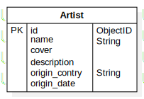

# Documentation

## MCD

### Comments

## UML 

## Update documentation 

For MCD documentation, we use [Mocodo Online](https://www.mocodo.net/)

Copy [mcd.mcd](./mcd/mcd.mcd) and paste it to genrate MCD

For ERD documentation, we use [Star UML](https://staruml.io/) 
